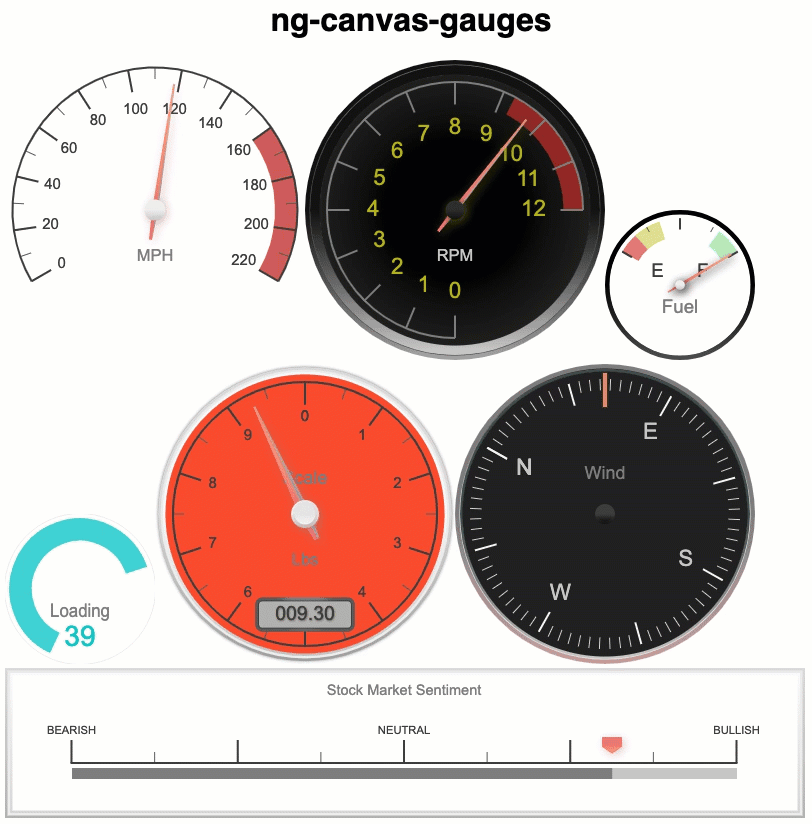

### Angular 6+ component wrapper for [@Mikhus'](https://github.com/Mikhus/canvas-gauges) canvas-gauges library.

### Getting Started
1. Install the package in your angular 6 or greater app
~~~
npm install ng-canvas-gauges
~~~
2. Import the GaugesModule to your AppModule file and register it in the imports:

~~~javascript 
import {BrowserModule} from '@angular/platform-browser';
import {NgModule} from '@angular/core';
import {AppComponent} from './app.component';

import {GaugesModule} from 'ng-canvas-gauges';

@NgModule({
    declarations: [
        AppComponent,
    ],
    imports: [
        BrowserModule,
        GaugesModule
    ],
    providers: [],
    bootstrap: [AppComponent]
})
export class AppModule {
}
~~~
3. Add the linear-gauge or radial-gauge element to your template:
~~~javascript
<linear-gauge width="150" height="400"></linear-gauge>
<radial-gauge width="400" height="400"></radial-gauge>
~~~

------------------------------------------------------

## More specific examples of data binding using attributes and component properties
~~~javascript
<linear-gauge
    width="150"
    height="400"
    units="°C"
    title="Temperature"
    min-value="-50"
    max-value="50"
    major-ticks="[-50,-40,-30,-20,-10,0,10,20,30,40,50]"
    minor-ticks="5"
    stroke-ticks="true"
    ticks-width="15"
    ticks-width-minor="7.5"
    highlights='[ {"from": -50, "to": 0, "color": "rgba(0,0, 255, .3)"},
    {"from": 0, "to": 50, "color": "rgba(255, 0, 0, .3)"} ]'
    color-major-ticks="#ffe66a"
    color-minor-ticks="#ffe66a"
    color-title="#eee"
    color-units="#ccc"
    color-numbers="#eee"
    color-plate="#2465c0"
    color-plate-end="#327ac0"
    border-shadow-width="0"
    borders="false"
    border-radius="10"
    needle-type="arrow"
    needle-width="3"
    animation-duration="250"
    animation-rule="linear"
    animated-value="true"
    color-needle="#222"
    color-needle-end=""
    color-bar-progress="#327ac0"
    color-bar="#f5f5f5"
    bar-stroke="0"
    bar-width="8"
    bar-begin-circle="false"
    [attr.value]="myValueProperty"
  ></linear-gauge>

  <radial-gauge 
    [options]="myOptionsProperty"
    [value]="myValueProperty"
  ><radial-gauge>
~~~
All canvas-gauge attributes are supported as shown above (kebab format) or 
programmatically (camelCase format). Learn more: [https://canvas-gauges.com/documentation/user-guide/configuration](https://canvas-gauges.com/documentation/user-guide/configuration)

------------------------------------------------------
## Build
This repo layout is based on an Angular 6 or greater workspace consists of the ng-canvas-gauge library project
and a demo angular app project. 

1. Install dependencies
~~~
npm install
~~~

2. Create an installable library (.tgz) for upload to the npm public repository or for local installation. 
    Output is to ./dist/ng-canvas-gauges/ folder.
~~~
npm run build:package
~~~

------------------------------------------------------

## Special Thanks

The upgrade of this library to angular 6+ and the demos project were developed using 
[CodeMix](https://www.genuitec.com/products/codemix/).

For supporting development!
